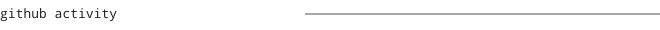
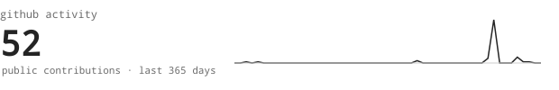
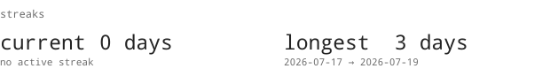
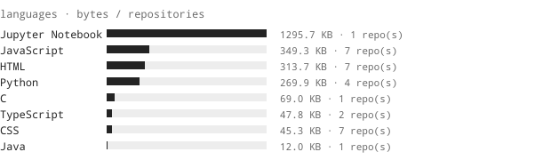
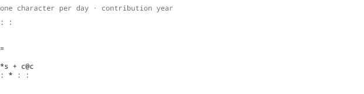

  

> I build AI-powered products, full-stack systems, and automation that turn
> repetitive work into software.

  <samp>AI / ML · Backend · Full Stack · Cloud · Systems</samp>

  <a href="https://github.com/MinionHub06">github</a> ·
  <a href="https://omnayak-portfolio.vercel.app">portfolio</a>

I am a Computer Science and Engineering student at VIT Vellore, interested in
machine learning, agentic systems, backend engineering, and practical software
architecture. I like taking an idea from a rough prototype to a working product,
then automating the parts that should not need a human twice.

- <samp>TriGuard</samp> — explainable ML for real-time SQL injection detection,
  combining XGBoost, SHAP, Flask, AWS SNS, and CloudWatch.
- <samp>Graham Scan</samp> — an interactive computational-geometry visualizer
  for robust convex-hull construction and drone-navigation experiments.
- <samp>OWLAI</samp> — frontend engineering work built around a practical web
  product workflow.
- <samp>GreenLens</samp> — intelligent waste classification research using
  computer vision, ML, and web technologies.
- <samp>UniRide</samp> — a VIT-focused ride-sharing platform using React,
  Firebase, Firestore, and Node.js.

<samp>Python · Java · C · C++ · JavaScript · React · Node.js · Flask · FastAPI</samp> 
<samp>MongoDB · Firebase · Firestore · SQL · AWS · Docker · GitHub Actions</samp> 
<samp>Machine Learning · Computer Vision · ViT · YOLO · XGBoost · SHAP</samp>

<samp>open to collaboration on AI/ML, backend systems, automation, and open-source projects.</samp>

---

this profile is generated from code, not a template.
